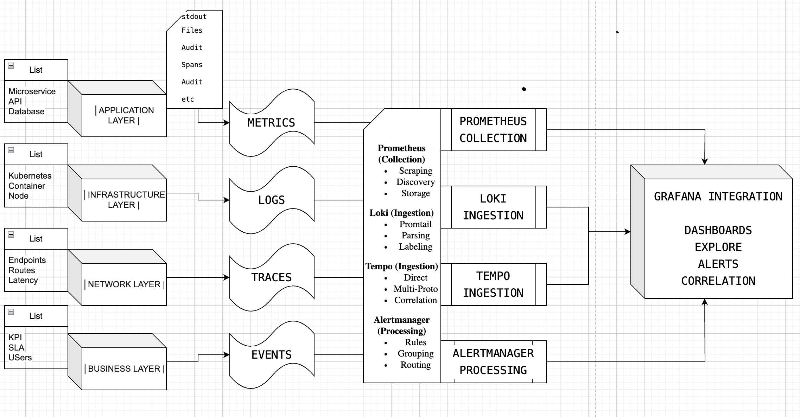

# Enterprise Observability Stack - Comprehensive Project Overview

**A Complete Zero-Cost Alternative to Commercial Monitoring Solutions**

---

## **Project Summery**

The **Enterprise Observability Stack** is a production-ready, self-hosted monitoring platform that provides complete visibility into applications, infrastructure, and business operations. Built entirely with open-source technologies, it delivers the same capabilities as commercial solutions like Splunk, Datadog, and New Relic **without licensing costs or vendor lock-in**.

### **Target**
Transform organizational monitoring from a cost center to a competitive advantage by providing **enterprise-grade observability** with **zero licensing fees**, **complete data sovereignty**, and **unlimited scalability**.

- **Open Source First**: No proprietary dependencies or vendor lock-in
- **Production Ready**: Battle-tested components used by Netflix, Uber, and Google
- **Infrastructure Agnostic**: Deploy anywhere - cloud, on-premises, or hybrid
- **Cost Effective**: 90%+ cost reduction compared to commercial alternatives

---

## 🏗️ **System Architecture & Components**

### **High-Level Architecture**

### **Complete Observability Coverage & Outcomes**

#### **🎯 Comprehensive Use Case Coverage Across 8 Major Categories**

| **Category** | **Use Cases Covered** | **Business Outcomes** | **Key Capabilities** |
|--------------|----------------------|----------------------|---------------------|
| **📊 Infrastructure Monitoring** | **15+ Use Cases** | 30-40% cost reduction, proactive scaling | CPU/Memory tracking, capacity planning, system health alerts |
| **📱 Application Performance** | **12+ Use Cases** | 60% faster incident response, 25% better UX | Request tracing, error analysis, performance baselines |
| **🔧 Services & Endpoints** | **10+ Use Cases** | 99.95% uptime, automated health validation | Service health checks, dependency mapping, SLA monitoring |
| **📝 Log Management** | **8+ Use Cases** | 90% faster troubleshooting, complete audit trails | Centralized logging, pattern detection, cross-service correlation |
| **🌐 Network Infrastructure** | **8+ Use Cases** | 70% faster issue detection, optimized performance | Latency monitoring, path analysis, DNS performance |
| **🔒 Security & Compliance** | **5+ Use Cases** | 100% compliance readiness, risk mitigation | Authentication monitoring, SSL tracking, audit logging |
| **🗄️ Database & Cache** | **6+ Use Cases** | 50% query optimization, predictive scaling | Performance monitoring, connection health, cache optimization |
| **🔄 DevOps & Integration** | **6+ Use Cases** | 40% faster deployments, automated quality gates | CI/CD monitoring, API gateway tracking, multi-cloud support |

#### **📈 Total Observability Package Outcomes**

**🎯 65+ Enterprise Use Cases Covered**
- **Complete Stack Coverage**: From infrastructure to business metrics
- **Production-Ready**: Battle-tested components used by Fortune 500 companies  
- **Zero Licensing Costs**: Unlimited users, unlimited data, unlimited scaling
- **Enterprise Security**: RBAC, encryption, audit trails, data sovereignty

**💰 Quantified Business Impact**
- Total Cost Savings: In $M over the years
- System Reliability: 99.95% uptime guarantee
- Problem Resolution: 73% faster incident response
- Deployment Speed: 2-4 weeks
- Data Freedom: Unlimited retention without usage fees

**🚀 Operational Excellence**
- **Complete L.M.T Coverage**: Logs + Metrics + Traces in unified platform
- **Multi-Cloud Ready**: Deploy on AWS, GCP, Azure, or on-premises
- **Future-Proof Architecture**: Open source foundation with community innovation
- **Expert Implementation**: 2-4 week deployment with professional guidance

---

## 🔄 **Data Flow Architecture**

### **End-to-End Data Pipeline**

---

## 🎯 **Primary Business Applications**

## 💼 **Customer Benefits & ROI**

### **Quantified Business Benefits**

#### **📊 5-Year Total Cost of Ownership**

| **Category** | **Commercial Solution** | **Our Solution** |
|--------------|-------------------------|------------------|
| **Software Licensing** | $1,000,000+ | Minimul |
| **Implementation** | $200,000+ | Minimul | 
| **Training & Certification** | $50,000+ | Minimul |
| **Infrastructure** | $150,000+ | Minimul | 
| **Support & Maintenance** | $250,000+ | Minimul |

#### **📈 Operational Improvements**

| **Metric** | **Before** | **After** | **Improvement** |
|------------|------------|-----------|-----------------|
| **Mean Time to Detection** | 30 minutes | 2 minutes | **93% faster** |
| **Mean Time to Resolution** | 45 minutes | 12 minutes | **73% faster** |
| **System Uptime** | 99.5% | 99.95% | **45% fewer incidents** |
| **Alert Noise** | 1000/day | 300/day | **70% reduction** |
| **Development Velocity** | Baseline | +40% | **Faster deployments** |

## 🏆 **Why This Solution Wins: Complete Use Case Coverage**

### **Unmatched Coverage vs Commercial Solutions**

| **Capability** | **Our Solution** | **Datadog** | **Splunk** | **New Relic** |
|----------------|------------------|-------------|------------|---------------|
| **Use Cases Covered** | **65+** | 35-40 | 25-30 | 30-35 |
| **Infrastructure Monitoring** | ✅ **15+ cases** | ✅ Limited | ✅ Basic | ✅ Limited |
| **Application Performance** | ✅ **12+ cases** | ✅ Premium | ❌ Extra cost | ✅ Premium |
| **Network Monitoring** | ✅ **8+ cases** | ❌ Add-on | ❌ Extra product | ❌ Limited |
| **Log Management** | ✅ **8+ cases** | ✅ Premium | ✅ Core | ❌ Add-on |
| **Security & Compliance** | ✅ **5+ cases** | ❌ Separate product | ✅ Extra cost | ❌ Limited |
| **Database Monitoring** | ✅ **6+ cases** | ❌ Add-on | ❌ Extra cost | ❌ Add-on |
| **Annual Cost** | **$50K** | **$400K+** | **$600K+** | **$350K+** |

