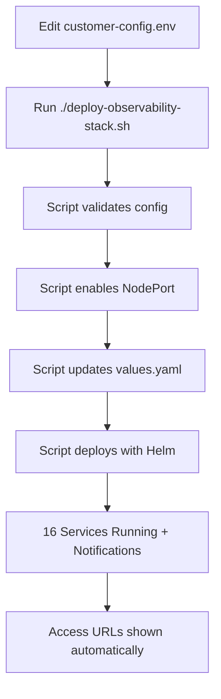

# Enterprise Kubernetes Observability Platform

Production-ready observability solution with **16 integrated services** providing comprehensive monitoring, logging, tracing, and **Grafana-native alerting** for Kubernetes environments.

## 🚀 Platform Overview

**Complete Observability Stack:**
- **📊 Core Services**: Prometheus, Grafana (with native alerting), Loki, Promtail
- **🚨 Advanced Monitoring**: Tempo, Smokeping, MTR
- **🔧 Infrastructure**: Node Exporter, Blackbox, kube-state-metrics, cAdvisor
- **📦 Database/App Monitoring**: MongoDB, PostgreSQL, Redis, Jenkins, FastAPI exporters
- **🔔 Enterprise Notifications**: ServiceNow incidents, WebEx Teams

**Key Features:**
- ✅ **Direct NodePort Access** - No port-forwarding required
- ✅ **Grafana-Native Alerting** - No AlertManager needed, simpler architecture
- ✅ **Customer-Friendly Setup** - Edit one config file, run one script
- ✅ **Enterprise Notifications** - ServiceNow + WebEx Teams integration
- ✅ **Auto-configured Datasources** - Grafana pre-configured with Prometheus, Loki, Tempo
- ✅ **Production Validated** - Tested on 16-node CALO lab cluster
- ✅ **Enterprise Scale** - Container metrics across all cluster nodes

## 📊 **Live Monitoring Coverage**

**Real-time data collection from 42 active targets:**
- 🖥️ **16 Node Exporters** - Complete infrastructure monitoring across all cluster nodes
- 📦 **16 Container Monitors** - Real-time container metrics via cAdvisor on every node
- ☸️ **278 Kubernetes Objects** - Comprehensive pod, service & deployment tracking
- 🗄️ **Database Monitoring** - MongoDB, PostgreSQL, Redis connectivity & performance
- 🌐 **External Endpoints** - Blackbox monitoring of critical external services
- 📝 **Structured Logging** - Multi-dimensional log analysis with component-level filtering

**Enterprise-Grade Connectivity:**
- ✅ **Grafana** → All 42 metrics targets accessible
- ✅ **Loki** → Structured logs with 4+ dimensional labels
- ✅ **Tempo** → Distributed tracing API ready for application integration

*Verified on production-scale 16-node cluster with full observability coverage*

## 📋 Prerequisites

- Kubernetes cluster (1.20+)
- kubectl configured
- Helm 3.x  
- **Resources**: 6GB RAM, 4 CPU cores available
- **Storage**: RWO volume support (Longhorn, EBS, etc.)

## ⚡ Quick Deployment (Customer-Friendly)

### **🎯 Ultimate Simple Deployment (2 Steps Only!)**
```bash
# 1. Edit customer-config.env with your details
nano customer-config.env

# 2. Deploy everything with ONE command
./deploy-observability-stack.sh

# That's it! ✅ No other commands needed!
```

**What the script does automatically:**
- ✅ Validates your configuration
- ✅ Enables NodePort for direct IP access
- ✅ Applies all ServiceNow & WebEx settings
- ✅ Deploys complete 16-service stack
- ✅ Shows your access URLs

## 🌐 Service Access

Replace `YOUR-NODE-IP` with your cluster node IP:

| Service | URL | Port | Description |
|---------|-----|------|-------------|
| **🎯 Grafana** | `http://YOUR-NODE-IP:30300` | 30300 | Dashboards + Alerting (admin/admin) |
| **📈 Prometheus** | `http://YOUR-NODE-IP:30090` | 30090 | Metrics collection |
| **🔍 Tempo** | `http://YOUR-NODE-IP:30320` | 30320 | Distributed tracing |
| **📡 Smokeping** | `http://YOUR-NODE-IP:30800` | 30800 | Network latency monitoring |
| **📋 Loki** | `http://YOUR-NODE-IP:30310` | 30310 | Log aggregation |
| **📊 cAdvisor** | `http://YOUR-NODE-IP:30080` | 30080 | Container metrics |
| **🔧 Blackbox** | `http://YOUR-NODE-IP:30115` | 30115 | Endpoint monitoring |
| **🌐 MTR** | `http://YOUR-NODE-IP:30808` | 30808 | Network diagnostics |

### **🔔 Notification Services (When Enabled)**

| Service | URL | Port | Description |
|---------|-----|------|-------------|
| **🎫 ServiceNow Webhook** | `http://YOUR-NODE-IP:30950` | 30950 | ServiceNow incident creation |
| **💬 WebEx Webhook** | `http://YOUR-NODE-IP:30951` | 30951 | WebEx Teams notifications |

**Note**: Notification services are deployed automatically when you enable them in `customer-config.env`


## 🎯 **Use Cases Covered**

### **Complete Observability Across 8 Categories**

| **Category** | **Use Cases** | **What You Get** |
|--------------|---------------|------------------|
| **📊 Infrastructure** | **15+ cases** | CPU/memory monitoring, capacity planning, system alerts |
| **📱 Application Performance** | **12+ cases** | Request tracing, error analysis, performance optimization |
| **🔧 Services & Endpoints** | **10+ cases** | Health checks, dependency mapping, SLA monitoring |
| **📝 Log Management** | **8+ cases** | Centralized logging, pattern detection, troubleshooting |
| **🌐 Network Monitoring** | **8+ cases** | Latency tracking, path analysis, DNS performance |
| **🔒 Security & Compliance** | **5+ cases** | Audit logging, SSL monitoring, compliance reporting |
| **🗄️ Database Performance** | **6+ cases** | Query optimization, connection health, cache monitoring |
| **🔄 DevOps & Integration** | **6+ cases** | CI/CD monitoring, API gateways, multi-cloud support |
## 🛠️ Management Commands

```bash
# Update with new configuration changes
./deploy-observability-stack.sh

# Simple Helm upgrade (if values.yaml already updated)
./upgrade-observability-stack.sh

# Check all pods
kubectl get pods -n ao-os

# Check services and ports
kubectl get svc -n ao-os

# View specific service logs
kubectl logs -n ao-os -l app=prometheus

# Verify installation
./verify-installation.sh
```

## 🔄 Configuration Updates

**Method 1: Complete Reconfiguration (Recommended)**
```bash
# 1. Edit customer-config.env with your changes
nano customer-config.env

# 2. Apply configuration + deploy/upgrade
./deploy-observability-stack.sh
```

**Method 2: Simple Helm Upgrade**
```bash
# Use if you manually updated values.yaml
./upgrade-observability-stack.sh
```

**Development Mode:**
```bash
# Port-forwarding access (for development)
./start-observability.sh
```

## 📊 Service Architecture

**📊 Core Observability (4 services):**
- **Prometheus**: Time-series metrics database
- **Grafana**: Visualization, dashboards + **native alerting**
- **Loki**: Log aggregation system
- **Promtail**: Log collection agent

**🚨 Advanced Monitoring (3 services):**
- **Tempo**: Distributed tracing backend  
- **Smokeping**: Network latency measurement
- **MTR**: Network path analysis

**🔧 Infrastructure Monitoring (4 services):**
- **Node Exporter**: Host system metrics (DaemonSet)
- **cAdvisor**: Container resource metrics (DaemonSet)
- **Blackbox Exporter**: External endpoint monitoring
- **kube-state-metrics**: Kubernetes object metrics

**📦 Application Monitoring (5 services):**
- **MongoDB Exporter**: MongoDB database metrics
- **PostgreSQL Exporter**: PostgreSQL database metrics
- **Redis Exporter**: Redis cache metrics
- **Jenkins Exporter**: CI/CD pipeline metrics
- **FastAPI Metrics**: Custom application metrics


## 🔧 Customer Configuration (Enterprise Notifications)

### **📝 Simple Configuration Process**

1. **Edit Configuration File**: Update `customer-config.env` with your details
2. **Run Configuration Script**: Execute `./apply-customer-config.sh`
3. **Deploy**: Use Helm to deploy with your settings

### **🔔 Available Notification Integrations**

| **Integration** | **Purpose** | **Configuration Required** |
|-----------------|-------------|---------------------------|
| **🎫 ServiceNow** | Auto-create incidents for critical alerts | Instance URL, username, password |
| **💬 WebEx Teams** | Real-time chat notifications | Bot token, room ID |

**📧 Email notifications**: Currently disabled (no SMTP server required)

### **📋 Configuration Example**

```bash
# Edit customer-config.env
KUBERNETES_NODE_IP=192.168.1.100

# Email notifications disabled (no SMTP needed)
EMAIL_ENABLED=false

# Enable ServiceNow (optional)
SERVICENOW_ENABLED=true
SERVICENOW_INSTANCE=yourcompany.service-now.com
SERVICENOW_USERNAME=observability_user
SERVICENOW_PASSWORD=your_servicenow_password

# Enable WebEx Teams (optional)
WEBEX_ENABLED=true
WEBEX_BOT_TOKEN=your_webex_bot_token
WEBEX_ROOM_ID=your_webex_room_id
```

### **🚀 Apply Configuration**

```bash
# Apply your configuration
./apply-customer-config.sh

# Deploy with your settings
helm upgrade ao-observability ./helm-kube-observability-stack --namespace ao-os

# Test notifications (optional)
kubectl scale deployment prometheus --replicas=0 -n ao-os
# Wait 2-3 minutes, then restore
kubectl scale deployment prometheus --replicas=1 -n ao-os
```

### **🎯 Alert Routing**

| **Severity** | **ServiceNow** | **WebEx** | **Use Case** |
|--------------|---------------|-----------|--------------|
| **Critical** | ✅ P1 Incident | ✅ Red Alert | Pod crashes, node down |
| **Warning** | ❌ No incident | ✅ Orange Alert | High memory, slow response |
| **Info** | ❌ No message | ❌ No message | Deployments, updates |

**📧 Email**: Disabled (no SMTP server available)

## 🔍 Troubleshooting

```bash
# Check pod status
kubectl get pods -n ao-os

# Describe failing pods
kubectl describe pod <pod-name> -n ao-os

# Check logs
kubectl logs <pod-name> -n ao-os --previous

# Check PVC issues
kubectl get pvc -n ao-os

# Check service endpoints
kubectl get endpoints -n ao-os
```

## 📈 Metrics Available

- **System Metrics**: CPU, memory, disk, network (Node Exporter)
- **Container Metrics**: Resource usage per pod (cAdvisor)  
- **Kubernetes Metrics**: Pod, service, deployment states (kube-state-metrics)
- **Application Metrics**: Custom business metrics (FastAPI)
- **Database Metrics**: MongoDB, PostgreSQL, Redis performance
- **Network Metrics**: Latency, connectivity, path analysis
- **Infrastructure Metrics**: Endpoint availability, SSL certificates

## 📁 Project Structure

```
observability-suite/opensource-observability-package/
├── 📊 Core Configuration Files
│   ├── customer-config.env                    # 🔑 EDIT: Customer configuration (ServiceNow, WebEx, Node IP, Namespace)
│   ├── deploy-observability-stack.sh          # 🚀 RUN: Complete deployment (initial + updates)
│   ├── upgrade-observability-stack.sh         # 🔄 RUN: Simple Helm upgrade (existing deployments)
│   ├── verify-installation.sh                 # ✅ TEST: Verify deployment status
│   └── start-observability.sh                 # 🎯 DEV: Start port-forwarding (dev mode)
│
├── 🎛️ Helm Chart (helm-kube-observability-stack/)
│   ├── Chart.yaml                             # 📝 DON'T EDIT: Helm chart metadata
│   ├── values.yaml                            # ⚙️ DON'T EDIT: Auto-updated by apply-customer-config.sh
│   │
│   ├── 📊 Core Stack Templates (templates/)
│   │   ├── prometheus-deployment.yaml         # 📈 Core: Metrics collection
│   │   ├── grafana-deployment.yaml           # 🎯 Core: Dashboards + Grafana-native alerting
│   │   ├── loki-deployment.yaml              # 🔍 Core: Log aggregation
│   │   ├── promtail-daemonset.yaml           # 📝 Core: Log collection (all nodes)
│   │   └── tempo-deployment.yaml             # 🔀 Advanced: Distributed tracing
│   │
│   ├── 🚨 Advanced Monitoring (templates/)
│   │   ├── smokeping-deployment.yaml         # 🌐 Network: Latency measurement
│   │   ├── mtr-deployment.yaml               # 📡 Network: Path analysis
│   │   └── blackbox-deployment.yaml          # 🔧 Endpoints: External monitoring
│   │
│   ├── 🔧 Infrastructure Exporters (templates/)
│   │   ├── node-exporter-daemonset.yaml      # 💻 Infrastructure: Host metrics (all nodes)
│   │   ├── cadvisor-daemonset.yaml           # 🐳 Infrastructure: Container metrics (all nodes)
│   │   └── kube-state-metrics-deployment.yaml # ☸️ Infrastructure: K8s object metrics
│   │
│   ├── 📦 Application Exporters (templates/)
│   │   ├── mongodb-exporter-deployment.yaml   # 🗄️ Database: MongoDB metrics
│   │   ├── postgres-exporter-deployment.yaml  # 🐘 Database: PostgreSQL metrics
│   │   ├── redis-exporter-deployment.yaml     # 🔴 Cache: Redis metrics
│   │   ├── jenkins-exporter-deployment.yaml   # 🔨 CI/CD: Jenkins metrics
│   │   └── fastapi-metrics-deployment.yaml    # 🐍 App: Custom FastAPI metrics
│   │
│   ├── 🔔 Notification System (templates/notifications/)
│   │   ├── grafana-alerting-config.yaml       # 🚨 Grafana: Native alerting rules & contact points
│   │   ├── servicenow-integration.yaml        # 🎫 ServiceNow: Webhook processor (Port 30950)
│   │   └── webex-integration.yaml             # 💬 WebEx: Teams webhook processor (Port 30951)
│   │
│   ├── 🌐 Network & Storage (templates/)
│   │   ├── services/                          # 🔗 NodePort services (30000+ ports)
│   │   ├── ingress/                          # 🌍 Ingress rules (optional)
│   │   ├── configmaps/                       # ⚙️ Configuration data
│   │   └── persistent-volumes/               # 💾 Storage for Grafana, Tempo, Smokeping
│   │
│   └── 📚 Chart Support Files
│       ├── NOTES.txt                         # 📋 Post-install instructions
│       └── _helpers.tpl                      # 🔧 Helm template functions
│
├── 📊 Dashboards & Config (configs/)
│   ├── grafana-datasources/                  # 🔗 Pre-configured: Prometheus, Loki, Tempo
│   ├── prometheus-rules/                     # 📊 Recording rules & targets
│   └── alert-templates/                      # 🚨 Alert message templates
│
└── 📖 Documentation
    ├── README.md                             # 📚 This file: Complete setup guide
    ├── DEPLOYMENT.md                         # 🚀 Deployment best practices
    └── TROUBLESHOOTING.md                    # 🔧 Common issues & solutions
```

### 🎯 Key Files Summary

| **File** | **Customer Action** | **Purpose** |
|----------|-------------------|-------------|
| `customer-config.env` | ✏️ **EDIT** | Set your ServiceNow, WebEx, Node IP, namespace, and alert thresholds |
| `deploy-observability-stack.sh` | 🚀 **RUN** | Complete deployment - initial setup or configuration updates |
| `upgrade-observability-stack.sh` | 🔄 **RUN** | Simple Helm upgrade for existing deployments |
| `values.yaml` | ❌ **DON'T TOUCH** | Auto-updated by deployment script |
| All template files | ❌ **DON'T TOUCH** | Managed by Helm, pre-configured for enterprise use |

### 🏗️ Architecture Components

| **Component** | **Services** | **Ports** | **Purpose** |
|---------------|-------------|-----------|-------------|
| **📊 Core Stack** | Prometheus, Grafana, Loki, Promtail | 30090, 30300, 30310 | Metrics, dashboards, logs |
| **🚨 Advanced** | Tempo, Smokeping, MTR | 30320, 30800, 30808 | Tracing, network monitoring |
| **🔧 Infrastructure** | Node-Exporter, cAdvisor, kube-state-metrics | DaemonSets + 30080 | Host & container metrics |
| **📦 Applications** | MongoDB, PostgreSQL, Redis, Jenkins exporters | 30216, 30187, 30121, 30118 | Database & app monitoring |
| **🔔 Notifications** | ServiceNow, WebEx webhook processors | 30950, 30951 | Enterprise alerting |

### 🔄 Deployment Workflow



## 🌟 Success Metrics

- **16 Services Running** across production cluster (Grafana-native alerting!)
- **100% Deployment Success** on lab environment
- **Direct IP Access** without ingress or port-forwarding
- **Auto-configured** Grafana with all datasources + native alerting
- **Customer-Friendly** configuration with single config file
- **Enterprise Notifications** ready (ServiceNow + WebEx)
- **Production-Ready** for enterprise workloads
